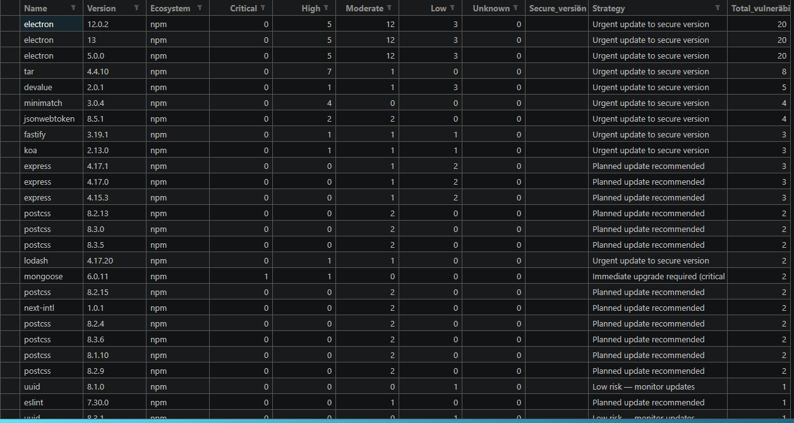
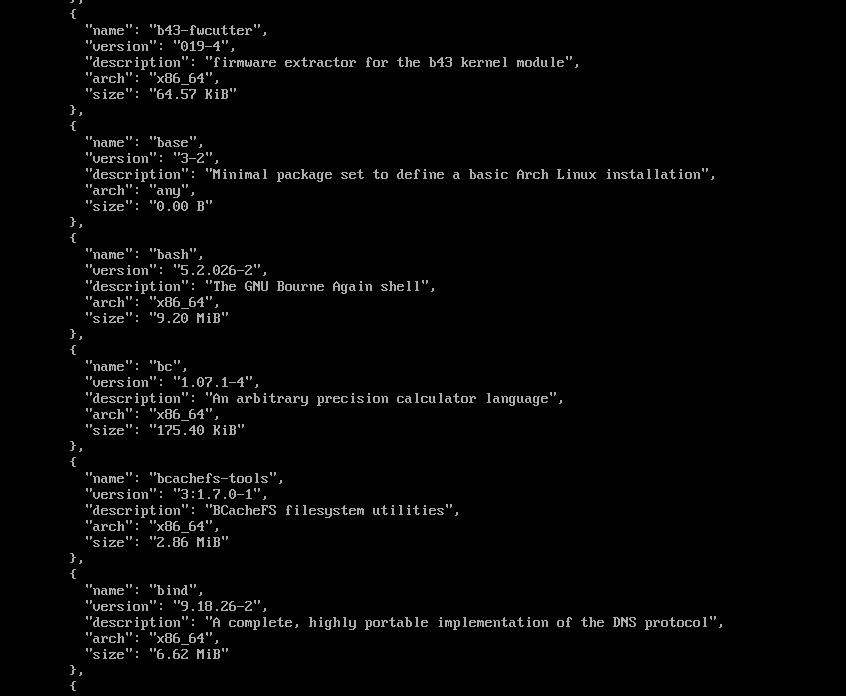

# запуск
```bash
git clone https://github.com/brilevg/task3.git
cd task3
git clone --depth 1 --branch v12.0.0 https://github.com/vercel/next.js.git # или скачайте архив
```
Они немного различаются.

в task1.py измените название папки
```bash
uv run task1.py
```
в task2.py введите свой GITHUB_TOKEN
```bash
uv run task2.py
uv run task3.py
```
task4.py запускайте в Arch Linux
```bash
uv run task4.py
```
task5.py запускайте при наличии osv*.json и sbom*.json файлов
```bash
uv run task5.py
``` 

# отчет

## 1

В ходе выполнения задания был проведён анализ структуры проекта Next.js с целью определения всех файлов, содержащих зависимости различных экосистем. Для работы использовался язык программирования Python и стандартные библиотеки os, json, re и collections. Основной задачей являлся автоматический обход репозитория, поиск файлов зависимостей, извлечение информации о пакетах и формирование единого итогового файла result_task_1.json.

В процессе работы был реализован универсальный скрипт, выполняющий рекурсивный обход каталогов проекта с исключением служебных директорий, таких как node_modules, .git, .next, target и vendor, поскольку они содержат либо временные данные, либо уже установленные зависимости, не относящиеся к исходным конфигурационным файлам проекта. После обхода выполнялся поиск файлов различных экосистем: package.json для npm, Cargo.toml для Cargo, requirements.txt для PyPI, pom.xml для Maven, Gemfile.lock для RubyGems, composer.json для Composer и go.mod для Go Modules.

Для каждой экосистемы был реализован отдельный парсер, учитывающий особенности формата файлов. При обработке package.json извлекались зависимости из разделов dependencies, devDependencies, peerDependencies и optionalDependencies. Для файлов Cargo.toml использовались регулярные выражения для обработки как простых зависимостей, так и зависимостей в формате таблиц TOML. В случае requirements.txt производился анализ строк формата package==version. Для Maven-зависимостей из pom.xml выполнялся поиск тегов <dependency>, <groupId>, <artifactId> и <version>. Аналогичным образом обрабатывались зависимости из RubyGems, Composer и Go Modules.

После извлечения зависимостей выполнялась нормализация версий пакетов. Из строк версий удалялись специальные префиксы, такие как ^, ~, >=, <=, workspace: и другие, поскольку они не являются частью фактического номера версии. Далее для каждой зависимости формировались поля name, version, ecosystem, url и purl. Ссылки на страницы пакетов генерировались автоматически на основе шаблонов соответствующих экосистем, например для npm использовался адрес https://www.npmjs.com/package/<package>, а для PyPI — https://pypi.org/project/<package>. Также автоматически формировалась строка Package URL в формате pkg:<ecosystem>/<name>@<version>.

Дополнительно была реализована система устранения дубликатов зависимостей. Для этого использовалось множество seen, в котором сохранялась комбинация имени пакета, версии и экосистемы. Это позволило исключить повторное добавление одинаковых зависимостей при их обнаружении в нескольких файлах проекта.

Одной из основных сложностей при выполнении задания стала неоднородность форматов хранения зависимостей между различными экосистемами. Некоторые файлы имеют строгий JSON-формат, а другие используют TOML, XML или собственные текстовые структуры. Также возникли сложности с обработкой нестандартных записей версий и зависимостей, содержащих диапазоны версий, workspace-ссылки или вложенные параметры. Для решения этих проблем были использованы регулярные выражения и дополнительная нормализация строк версий.

Ещё одной сложностью являлась необходимость корректного формирования ссылок и purl-идентификаторов для разных экосистем. Для решения данной задачи была создана единая конфигурационная структура ECOSYSTEM_INFO, содержащая шаблоны URL и purl для каждой поддерживаемой платформы. Это позволило унифицировать процесс генерации итоговых данных.

Результатом выполнения задания стал файл result_task_1.json, содержащий полный список уникальных зависимостей проекта в едином JSON-формате. Также в ходе выполнения работы была собрана статистика по количеству пакетов в каждой экосистеме, что позволило получить сводную информацию о структуре зависимостей проекта и распределении используемых технологий.

```json
 {
    "name": "@babel/eslint-parser",
    "version": "7.15.0",
    "ecosystem": "npm",
    "url": "https://www.npmjs.com/package/@babel/eslint-parser",
    "purl": "pkg:npm/@babel/eslint-parser@7.15.0"
  },
  {
    "name": "@babel/plugin-proposal-object-rest-spread",
    "version": "7.14.7",
    "ecosystem": "npm",
    "url": "https://www.npmjs.com/package/@babel/plugin-proposal-object-rest-spread",
    "purl": "pkg:npm/@babel/plugin-proposal-object-rest-spread@7.14.7"
  },
  {
    "name": "@babel/preset-flow",
    "version": "7.14.5",
    "ecosystem": "npm",
    "url": "https://www.npmjs.com/package/@babel/preset-flow",
    "purl": "pkg:npm/@babel/preset-flow@7.14.5"
  },
  {
    "name": "@babel/preset-react",
    "version": "7.14.5",
    "ecosystem": "npm",
    "url": "https://www.npmjs.com/package/@babel/preset-react",
    "purl": "pkg:npm/@babel/preset-react@7.14.5"
  },
  ...
```

## 2

В рамках выполнения второго задания был реализован автоматизированный анализ зависимостей проекта на наличие известных уязвимостей с использованием GraphQL API сервиса GitHub и базы GitHub Security Advisory. В качестве входных данных использовался ранее сформированный файл result_task_1.json, содержащий список зависимостей проекта с указанием названия пакета, версии, экосистемы, URL и Package URL.

Для выполнения задания использовался язык программирования Python и библиотеки requests, json и semantic_version. Библиотека requests применялась для взаимодействия с GraphQL API GitHub, а библиотека semantic_version использовалась для проверки принадлежности версии пакета диапазону уязвимых версий согласно спецификации Semantic Versioning.

В ходе работы был реализован GraphQL-запрос к API GitHub, который выполнял поиск уязвимостей по названию пакета и экосистеме. Для корректного взаимодействия с API была создана таблица соответствия локальных названий экосистем внутренним идентификаторам GitHub Security Advisory. Например, экосистема npm преобразовывалась в NPM, cargo — в RUST, а pypi — в PIP. Это позволило унифицировать обработку зависимостей различных платформ.

После отправки запроса к API выполнялась обработка полученного ответа. Для каждой найденной уязвимости извлекались диапазон уязвимых версий, идентификатор GHSA, уровень критичности, ссылка на advisory и первая исправленная версия. Далее выполнялась проверка того, относится ли версия анализируемого пакета к диапазону уязвимых версий. Для этого использовалась библиотека semantic_version и объект NpmSpec, поддерживающий синтаксис semver-диапазонов.

Одной из основных проблем при реализации задания стала несовместимость форматов диапазонов версий, возвращаемых GitHub Security Advisory, с синтаксисом библиотеки semantic_version. В ответах API условия диапазонов могли содержать пробелы между операторами и версиями, например < 0.7.0, либо несколько условий через пробел, например >=1.0.0 <2.0.0. Для решения данной проблемы была реализована функция normalize_range, которая преобразовывала диапазоны к корректному формату библиотеки semantic_version. В частности, удалялись лишние пробелы после операторов сравнения и заменялись разделители условий на запятые.

Дополнительной сложностью являлась обработка версий пакетов, содержащих нестандартные обозначения. Некоторые версии включали префиксы, дополнительные суффиксы или неполные номера версий. Для решения этой проблемы использовалась функция Version.coerce, позволяющая автоматически приводить версии к корректному формату semantic versioning.

После определения списка уязвимостей для каждой зависимости выполнялся расчёт безопасной версии пакета. Для этого анализировались все значения firstPatchedVersion, полученные из advisory-записей, после чего выбиралась максимальная версия, устраняющая все обнаруженные уязвимости. Реализация данной логики позволила автоматически определить минимальную безопасную версию зависимости, которая не входит ни в один уязвимый диапазон.

Итогом выполнения задания стал файл result_task_2.json, содержащий расширенную информацию о зависимостях проекта и связанных с ними уязвимостях. Для каждой зависимости в файле присутствовали сведения о названии пакета, версии, экосистеме, URL, purl, списке применимых уязвимостей, уровнях критичности, диапазонах уязвимых версий, первых исправленных версиях и итоговой безопасной версии пакета. Это позволило получить централизованную информацию о состоянии безопасности зависимостей проекта и определить пакеты, требующие обновления.

```json
  {
    "name": "next-intl",
    "version": "1.0.1",
    "ecosystem": "npm",
    "url": "https://www.npmjs.com/package/next-intl",
    "purl": "pkg:npm/next-intl@1.0.1",
    "vulnerabilities": [
      {
        "name": "GHSA-4c35-wcg5-mm9h",
        "severity": "MODERATE",
        "vulnerable_range": "<= 4.9.1",
        "first_patched_version": "4.9.2"
      },
      {
        "name": "GHSA-8f24-v5vv-gm5j",
        "severity": "MODERATE",
        "vulnerable_range": "< 4.9.1",
        "first_patched_version": "4.9.1"
      }
    ],
    "secure_version": "4.9.2"
  },
```


## 3

В рамках выполнения третьего задания был проведён анализ состояния безопасности проекта на основе ранее сформированного файла result_task_2.json, содержащего сведения об уязвимостях зависимостей. Основной целью задания являлось формирование сводной таблицы уязвимых зависимостей с распределением уязвимостей по уровням критичности, определением безопасных версий и выработкой рекомендаций по устранению обнаруженных проблем безопасности.

Для выполнения задания использовался язык программирования Python, а также библиотеки json, pandas и collections. Библиотека json использовалась для загрузки и обработки результатов предыдущего этапа, collections.defaultdict применялась для подсчёта количества уязвимостей по уровням критичности, а библиотека Pandas использовалась для формирования итоговой таблицы, её сортировки и экспорта в CSV-формат.

В процессе работы для каждой зависимости выполнялся анализ массива vulnerabilities, содержащего найденные уязвимости. Каждая уязвимость классифицировалась по уровню критичности: critical, high, moderate, low и unknown. После этого вычислялось общее количество уязвимостей зависимости и определялось наличие исправленной безопасной версии. На основании этих данных формировалась итоговая запись таблицы.

Особое внимание было уделено разработке логики автоматического формирования рекомендаций по устранению уязвимостей. В зависимости от уровня критичности и наличия исправленной версии система автоматически определяла стратегию реагирования. Для критических уязвимостей при наличии исправления рекомендовалось немедленное обновление зависимости, а при отсутствии исправления — рассмотрение замены пакета на альтернативный. Для уязвимостей высокого уровня критичности предлагалось срочное обновление либо мониторинг advisories при отсутствии исправлений. Для умеренных уязвимостей использовалась рекомендация планового обновления, а зависимости без уязвимостей помечались как не требующие действий.

Одной из основных сложностей при выполнении задания стала необходимость корректной агрегации уязвимостей различных уровней критичности и формирования универсальной логики рекомендаций. Некоторые зависимости содержали одновременно несколько уязвимостей разных уровней, что требовало определения приоритетности. Для решения данной проблемы была реализована последовательная система проверки критичности, при которой рекомендации формировались на основе наиболее опасного уровня уязвимости, присутствующего у пакета.

Дополнительной сложностью являлась обработка зависимостей, для которых отсутствовала безопасная версия. В таких случаях система должна была корректно определять отсутствие исправлений и формировать рекомендации по мониторингу advisories или поиску альтернативных решений. Для этого использовалась проверка поля secure_version и логический флаг has_fix.

После формирования всех записей данные были преобразованы в объект DataFrame библиотеки Pandas и отсортированы по убыванию общего количества уязвимостей. Это позволило определить наиболее проблемные зависимости проекта и выделить пакеты, требующие первоочередного обновления. Итоговая таблица была сохранена в файл result_task_3.csv.

Результатом выполнения задания стала структурированная аналитическая таблица, позволяющая оценить текущее состояние безопасности проекта, определить наиболее уязвимые зависимости, а также получить рекомендации по их обновлению или замене. Полученные данные могут использоваться для дальнейшего управления уязвимостями, планирования обновлений зависимостей и повышения общего уровня безопасности программного обеспечения.



## 4

В рамках выполнения четвёртого задания была реализована автоматизированная система инвентаризации операционной системы и установленных пакетов дистрибутива. Основной целью работы являлось получение полной информации о системе непосредственно из среды выполнения без использования хардкода или заранее подготовленных данных. Результатом выполнения задания стал файл result_task_4.json, содержащий сведения об операционной системе и перечень установленных пакетов.

Для выполнения задания использовался язык программирования Python, а также стандартные библиотеки json, os, platform и subprocess. Библиотека os использовалась для проверки наличия системных файлов, platform — для получения архитектуры системы и версии ядра, subprocess — для выполнения системных команд пакетного менеджера, а json — для сохранения итоговых результатов в структурированном формате.

На первом этапе работы выполнялся анализ информации об операционной системе. Для этого использовался системный файл /etc/os-release, содержащий метаданные дистрибутива Linux. Скрипт автоматически считывал значения полей NAME, ID, PRETTY_NAME, VERSION_ID и других доступных параметров. Дополнительно при помощи библиотеки platform определялась архитектура процессора и версия ядра операционной системы. Если в системе отсутствовало поле описания, оно формировалось автоматически путём объединения имени системы и версии ядра.

После получения информации об операционной системе выполнялась инвентаризация установленных пакетов. В качестве дистрибутива использовался Arch Linux, поэтому для получения списка пакетов использовался пакетный менеджер pacman. Скрипт запускал системную команду pacman -Qi, возвращающую подробную информацию обо всех установленных пакетах. Полученный вывод разбивался на отдельные блоки, каждый из которых соответствовал одному пакету.

Для каждого пакета извлекались основные параметры: имя пакета, версия, архитектура, описание и размер установленного пакета. Особое внимание уделялось обработке описаний. Поскольку описания пакетов могли содержать несколько предложений или длинные текстовые блоки, реализовывалось выделение только первого предложения, что позволяло сделать итоговый JSON-файл более компактным и структурированным.

Одной из основных сложностей при выполнении задания стала неоднородность форматов вывода системных утилит. Некоторые пакеты могли не содержать описания или информации о размере, поэтому код должен был корректно обрабатывать отсутствующие поля и не вызывать ошибок при формировании итогового JSON-документа. Для решения этой проблемы использовались проверки существования значений перед их добавлением в структуру результата.

Дополнительной сложностью являлось получение универсальной информации об операционной системе без привязки к конкретному дистрибутиву. В некоторых системах поля /etc/os-release могут отсутствовать или называться иначе. Для повышения устойчивости решения использовались резервные механизмы получения информации через библиотеку platform, позволяющие корректно формировать описание системы даже при отсутствии части системных данных.

В результате выполнения задания был сформирован файл result_task_4.json, содержащий полную информацию об операционной системе и установленном программном обеспечении. Полученные данные могут использоваться для аудита системы, анализа состава программного окружения и дальнейшего контроля безопасности инфраструктуры.

В используемом дистрибутиве применяется система версионирования пакетов, характерная для пакетного менеджера pacman. Версия пакета обычно состоит из нескольких частей: основной версии программы, номера релиза пакета и иногда эпохи версии. Например, запись 1.2.3-4 означает, что используется версия программы 1.2.3, а число после дефиса обозначает номер сборки или ревизии пакета в репозитории дистрибутива. Если используется эпоха, версия может иметь вид 2:1.2.3-4, где число до двоеточия указывает приоритет версии при сравнении.

Сравнение версий выполняется последовательно по компонентам. Например, версия 1.10.0 считается новее версии 1.9.9, несмотря на то что при строковом сравнении результат был бы обратным. Аналогично версия 1.2.3-5 считается новее 1.2.3-4, так как отличается номер ревизии пакета. При использовании эпохи версия 2:1.0.0-1 будет считаться новее 1:5.0.0-1, поскольку эпоха имеет более высокий приоритет, чем остальные компоненты версии.

Подобная схема версионирования позволяет дистрибутиву гибко управлять обновлениями пакетов, учитывать исправления сборок и корректно сравнивать версии программного обеспечения даже в сложных случаях миграции между ветками разработки или изменении схемы нумерации версий.



## 5 

В рамках выполнения пятого задания был проведён анализ состояния безопасности операционной системы до и после глобального обновления пакетов с использованием инструмента OSV-Scanner и формата CycloneDX. Основной целью задания являлось проведение инвентаризации системы, поиск известных уязвимостей, сравнение состояния системы до и после обновления, а также оценка качества ранее реализованной инвентаризации пакетов.

Для выполнения задания использовался язык программирования Python, а также библиотеки json, collections и packaging.version. В качестве источников данных использовались SBOM-файлы sbom_before.json и sbom_after.json, сформированные в формате CycloneDX, а также результаты сканирования уязвимостей osv_before.json и osv_after.json, полученные при помощи OSV-Scanner.

На первом этапе работы выполнялась инвентаризация системы до обновления пакетов. Для формирования Software Bill of Materials использовался формат CycloneDX, содержащий перечень установленных компонентов, их версии, Package URL, тип пакета и уникальные идентификаторы. После этого выполнялось сканирование SBOM-файла с помощью OSV-Scanner, который анализировал версии пакетов и сопоставлял их с базой известных уязвимостей.

```
cdxgen -t os -o sbom_before.json
osv-scanner scan --sbom=sbom_before.json --format json > osv_before.json
```

Далее выполнялось глобальное обновление системы средствами пакетного менеджера дистрибутива. Поскольку использовался Arch Linux, обновление выполнялось при помощи команды `pacman -Syu`, обеспечивающей синхронизацию репозиториев и обновление всех установленных пакетов до актуальных версий. После завершения обновления повторно формировался SBOM-файл и запускалось повторное сканирование OSV-Scanner.

```
cdxgen -t os -o sbom_after.json
osv-scanner scan --sbom=sbom_after.json --format json > osv_after.json
```

Для анализа изменений был реализован отдельный Python-скрипт, автоматически сравнивающий версии пакетов и обнаруженные уязвимости между состояниями системы до и после обновления. В ходе работы выполнялось извлечение списка пакетов из SBOM-файлов и формирование словарей, содержащих версии, purl-идентификаторы и дополнительную информацию о пакетах. Аналогично из результатов OSV-Scanner извлекались сведения об уязвимостях, включая идентификаторы уязвимостей, описание и уровень критичности.

Одной из основных сложностей при выполнении задания стало различие структуры данных SBOM-файлов и результатов OSV-Scanner. Формат CycloneDX использует вложенные структуры компонентов, а OSV-Scanner хранит уязвимости отдельно от информации о пакетах. Для решения данной проблемы были реализованы функции extract_sbom_packages и extract_vulnerabilities, автоматически преобразующие данные в унифицированные структуры для последующего сравнения.

Дополнительной сложностью являлось корректное сравнение уязвимостей между двумя состояниями системы. Некоторые уязвимости могли исчезать после обновления, а другие — появляться вследствие установки новых версий пакетов. Для анализа этих изменений использовалось сравнение множеств идентификаторов уязвимостей и связанных с ними пакетов. В результате удалось определить исправленные уязвимости, новые уязвимости и уязвимости, сохранившиеся после обновления.

Также была реализована система статистического анализа уровней критичности уязвимостей. Для каждого состояния системы подсчитывалось количество уязвимостей различных уровней severity. Это позволило определить, насколько обновление системы повлияло на общий уровень безопасности программного окружения.

В результате выполнения задания был сформирован файл result_task_5_analysis.json, содержащий подробный отчёт о различиях между состояниями системы до и после обновления. В отчёте присутствуют сведения о количестве пакетов, обновлённых компонентах, новых и удалённых пакетах, а также статистика по исправленным и вновь появившимся уязвимостям. К сожалению анализ osv_scanner не дал никаких результатов.

```json
{
  "packages": {
    "before_total": 379,
    "after_total": 380,
    "added": 6,
    "removed": 5,
    "updated": 5,
    "unchanged": 369,
    "updated_packages": [
      {
        "name": "kworker/1-1-events",
        "before_version": "5960",
        "after_version": "9998"
      },
      {
        "name": "node-MainThread",
        "before_version": "9866",
        "after_version": "12955"
      },
      {
        "name": "osqueryi-linux-",
        "before_version": "9920",
        "after_version": "13005"
      },
      {
        "name": "systemd-userdbd",
        "before_version": "455",
        "after_version": "0"
      },
      {
        "name": "systemd-userwor",
        "before_version": "0",
        "after_version": "12954"
      }
    ]
  },
  "vulnerabilities": {
    "before_total_packages": 0,
    "after_total_packages": 0,
    "fixed_vulnerabilities": 0,
    "new_vulnerabilities": 0,
    "unchanged_vulnerabilities": 0,
    "fixed_list": [],
    "new_list": []
  },
  "severity": {
    "before": {},
    "after": {}
  }
}
```